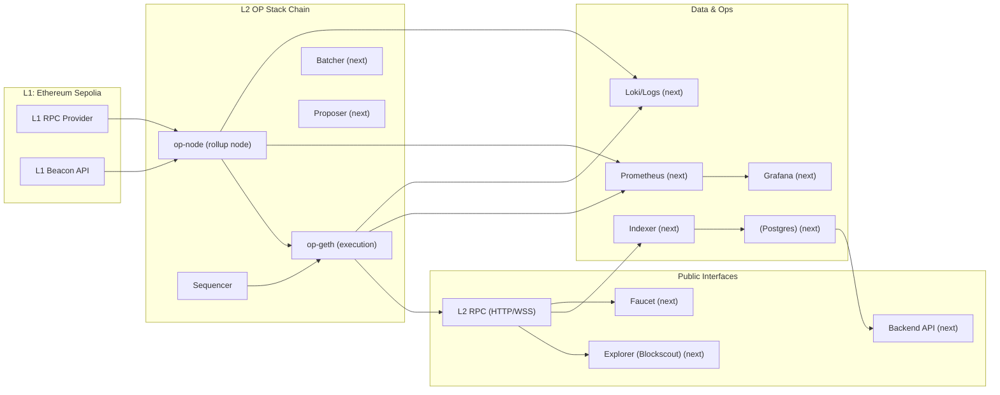

# WEB3-STACK-LAB

One repository = one system.

## What it is

I’m building an **OP Stack L2 network** with production-like ops basics: **public RPC, explorer, faucet, indexer + API, monitoring, and runbooks**.

**Statement:** “I run an OP Stack-based L2 with a public RPC, explorer, and API, suitable for deploying contracts and testing applications.”

## MVP boundaries

- **Phase 1:** local devnet (Docker Compose) → then public testnet.
- Not chasing decentralization at first. Goal: **production-like operations**.

## Defaults

- **L1:** Ethereum Sepolia
- **L2:** OP Stack (`op-node`, `op-geth`, sequencer + (next) batcher/proposer)

## Threat model (minimal)

- Compromise of keys: sequencer / batcher / proposer / faucet
- RPC outage / latency degradation
- L1 reorg → impact on derivation & indexer correctness
- DoS on public RPC

## Architecture



### Quickstart (local devnet)

Runtime lives in `infra/l2-node/`.

### Prerequisites

- Docker + Docker Compose
- `jq`, `openssl`
- Foundry (`forge`, `cast`)

### 1) Configure

Create `.env` (do not commit it):

```bash
cp infra/l2-node/.env.example infra/l2-node/.env
# edit infra/l2-node/.env:
# - L1_RPC_URL (Sepolia RPC)
# - L1_BEACON_URL (Sepolia beacon)
# - PRIVATE_KEY (sequencer signer key)
# - P2P_ADVERTISE_IP (127.0.0.1 for local)
```

Generate JWT for Engine API:

```bash
openssl rand -hex 32 > infra/l2-node/jwt.txt
chmod 600 infra/l2-node/jwt.txt
```

Initialize op-geth (once):

```bash
docker run --rm \
  -v $(pwd)/infra/l2-node:/workspace \
  -w /workspace \
  us-docker.pkg.dev/oplabs-tools-artifacts/images/op-geth:v1.101605.0 \
  init --datadir=./op-geth-data --state.scheme=hash ./genesis.json
```

### 2) Start

```bash
cd infra/l2-node
docker compose up -d
docker compose ps
```

### 3) Check health

**L2 RPC:**
```bash
cast block-number --rpc-url http://localhost:8545
```

**Sequencer admin:**
```bash
curl -s -X POST -H "Content-Type: application/json" \
  --data '{"jsonrpc":"2.0","method":"admin_sequencerActive","params":[],"id":1}' \
  http://localhost:8547
```

### 4) Hello tx (deploy + increment + read)

See [contracts/README.md](contracts/README.md).

## Documentation

- `docs/statement.md` — statement + requirements
- `docs/threat-model.md` — trust assumptions, risks, mitigations
- `docs/architecture.md` — architecture diagram + data flow + secrets
- `docs/runbooks.md` — troubleshooting and recovery playbooks

## Repository map

- `chain/` — OP Stack deployment outputs & configs (`genesis.json`, `rollup.json`, `state.json`)
- `infra/` — docker-compose for node / explorer / monitoring
- `infra/l2-node/` — local OP Stack node (op-geth + op-node)
- `contracts/` — demo contracts (Counter now; verifiers later)
- `services/` — faucet / indexer / api (next)
- `backend/`, `frontend/`, `zk/`, `oracle/` — later stages

## Milestones

- [x] Day 1: repo + scaffolding
- [x] Day 2–3: local OP Stack devnet + first L2 transactions
- [x] Day 4: Blockscout explorer + faucet (rate-limit + logs)
- [x] Day 5–6: indexer + Postgres + backend API
- [x] Day 7: monitoring + runbooks