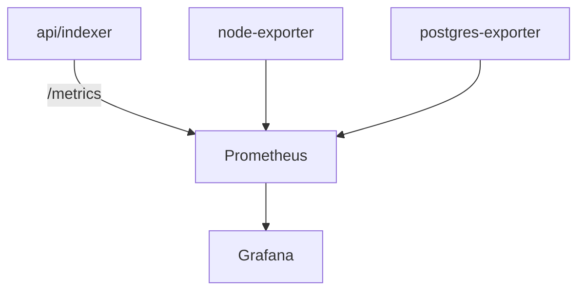

# Monitoring Infrastructure

Observability stack for the L2 devnet infrastructure.

This directory contains configuration for:
- **Prometheus** (metrics collection)
- **Grafana** (dashboards)
- **Alert rules**
- **Datasource provisioning**

**Entry point:** `infra/services/docker-compose.yml`

## Structure

```txt
monitoring/
├── alerts
│   └── alerts.rules.yml
├── grafana
│   ├── dashboards
│   │   └── l2-health.json
│   └── provisioning
│       ├── dashboards.yml
│       └── datasources.yml
└── prometheus
    └── prometheus.yml
```

## Components

### Prometheus
Scrapes metrics from infra services.

**Config:** `monitoring/prometheus/prometheus.yml`

**UI:** http://localhost:9090

**Scrape targets:**
- `api`
- `indexer`
- `node-exporter`
- `postgres-exporter`

### Grafana
Visualization + alert dashboards.

**Provisioned from:** `monitoring/grafana/provisioning`

**UI:** http://localhost:3003

**Credentials:** `admin` / `admin`

**Dashboard:** `L2 Health`

## Alerts

Defined in: `monitoring/alerts/alerts.rules.yml`

**Current alerts:**
- `APIDown`
- `IndexerDown`
- `L2RPCDown`
- `IndexerLagHigh`
- `IndexerNotProgressing`
- `DiskFreeLow`

> [!NOTE]
> Alerts are evaluated by Prometheus and shown in Grafana.

## Metrics Flow



## Start Monitoring

From `infra/services`:

```bash
docker compose up -d prometheus grafana node-exporter postgres-exporter
```

## Verify

1.  **Prometheus targets:** http://localhost:9090/targets
2.  **Grafana:** http://localhost:3003

**Test metrics manually:**

```bash
# API metrics
curl http://localhost:3001/metrics

# Indexer metrics
curl http://localhost:9102/metrics
```

## L2 Health Dashboard

The dashboard tracks:
- RPC availability
- Indexer progress
- Indexer lag
- DB activity
- Disk usage
- Host resources

> [!TIP]
> This monitoring setup is intentionally minimal but production-like. The goal is to simulate rollup infra observability, not full production SRE tooling.