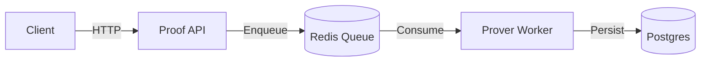

# 🚀 Proof API

The **Proof API** is an HTTP service responsible for accepting proof generation requests and managing the lifecycle of proof jobs.

> [!IMPORTANT]
> It does NOT generate proofs itself.

Instead, it:
- ✅ validates requests
- ✅ persists jobs in **Postgres**
- ✅ enqueues proving tasks in **Redis**
- ✅ exposes job status endpoints
- ✅ exposes **Prometheus metrics**

The **prover-worker** consumes jobs from the queue.

---

## 🏗️ Architecture Role

Proof API is the entry point of the ZK proving pipeline:



The API is **stateless**. All state lives in Postgres and Redis.

---

## 🔌 Endpoints

### Health Check

`GET /health`

Returns service status.

---

### Create Proof Job

`POST /proofs`

**Request Body:**

```json
{
  "root": "0x...",
  "user": "0x...",
  "epoch": 1,
  "leaf": "0x..."
}
```

**Response:**

```json
{
  "id": "uuid"
}
```

---

### Get Proof Job

`GET /proofs/:id`

**Returns:**
- status
- request
- publicInputs
- proof (stub in MVP)

---

### List Jobs

`GET /proofs?limit=20`

---

### Metrics

`GET /metrics`

Prometheus-compatible metrics.

---

## 🔧 Environment Variables

| Variable | Description | Default |
| :--- | :--- | :--- |
| `PORT` | API Port | `8080` |
| `DATABASE_URL` | Postgres connection string | `postgres://...` |
| `REDIS_URL` | Redis connection string | `redis://...` |
| `QUEUE_NAME` | Job queue name | `prove` |
| `LOG_LEVEL` | Logging verbosity | `info` |

---

## 🏃 Running Locally

From the repo root:

```bash
docker compose -f infra/services/zk/docker-compose.zk.yml up -d --build
```

API will be available at:
`http://localhost:3101`

---

## 💡 Design Decisions

### Async Proving
Proof generation is asynchronous because proving can take seconds to minutes.

### Durable Jobs
Jobs are persisted before enqueueing to avoid loss.

### Queue-based Architecture
Redis queue decouples API latency from prover performance.

---

## 🛡️ Security Model (MVP)

The API is **not a trust boundary**.

**Security relies on:**
- Circuit correctness
- Verifier contract
- Public input binding

**Future improvements:**
- [ ] Authentication
- [ ] Rate limiting
- [ ] Job deduplication
- [ ] Replay protection
