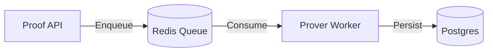
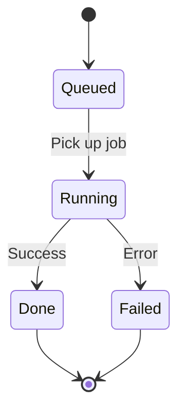

# ⚙️ Prover Worker

The **prover-worker** is responsible for generating ZK proofs in the background.

It consumes jobs from **Redis** and writes results to **Postgres**.

> [!NOTE]
> In the MVP, the worker produces **stub proofs**. Later phases will integrate real circuit proving via **snarkjs**.

---

## 🏗️ Architecture Role



The worker is **horizontally scalable**. Multiple workers can process the same queue.

---

## ✅ Responsibilities

- [x] Consumes proof jobs
- [x] Generates witness
- [ ] Generates proof (future phase)
- [x] Persists results
- [x] Exposes metrics

---

## 🔄 Worker Lifecycle



**The worker guarantees:**
1. Idempotent processing
2. Status persistence
3. Retry safety (future)

---

## 📊 Metrics

Exposed via `/metrics`.

**Typical metrics:**
- `jobs_processed_total`
- `job_duration_seconds`
- `job_failures_total`
- `queue_depth`

---

## 🔧 Environment Variables

| Variable | Description | Default |
| :--- | :--- | :--- |
| `DATABASE_URL` | Postgres connection | `postgres://...` |
| `REDIS_URL` | Redis connection | `redis://...` |
| `QUEUE_NAME` | Job queue name | `prove` |
| `WORKER_CONCURRENCY` | Parallel jobs | `2` |
| `LOG_LEVEL` | Logging verbosity | `info` |
| `METRICS_PORT` | Prometheus metrics | `9101` |

---

## 🏃 Running Locally

Worker is started via docker-compose:

```bash
docker compose -f infra/services/zk/docker-compose.zk.yml up
```

---

## ⚠️ Failure Model

Worker failures must **not** corrupt job state.

**If a worker crashes:**
- Jobs remain in Redis
- Job state remains in Postgres
- Another worker can resume processing

---

## 🔮 Future Responsibilities

Later phases will add:

- [ ] Real witness generation
- [ ] SnarkJS proving
- [ ] Proof artifact storage
- [ ] Retry strategy
- [ ] Timeout handling
- [ ] Batching
- [ ] GPU provers

---

## 🚫 Non-Goals (MVP)

- Decentralized proving
- Proof marketplace
- Hardware optimization